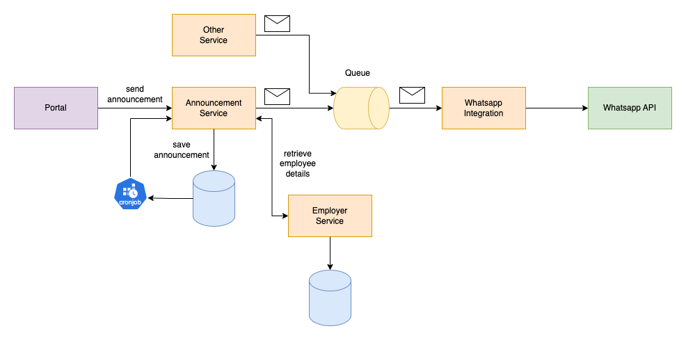

# Announcement Service

## High Level Diagram

A high level diagram of a potential solution.



## Requirements

### AWS

An AWS account is required with access to a SQS queue as well as a DynamoDB table.

Once created, the following settings can be configured in the environment or in a `.env` file:

```bash
AWS_REGION
SQS_QUEUE_URL
DYNAMODB_TABLE_NAME
EMPLOYEES_SERVICE_BASE_URL
```

### Dependencies

The dependencies of the project are managed with [poetry](https://python-poetry.org/docs/cli/), this should be installed first.

Install the required dependencies using: `poetry install`

### Environment

The `app` directory should be added to your `PYTHONPATH` environmental var, this can be achieved by simply setting it in your environment.

## Running

To run, use the following command: `PYTHONPATH=app uvicorn main:app --reload`

## Testing

To run the test suite, use the following command: `python -m pytest -svvvx`
